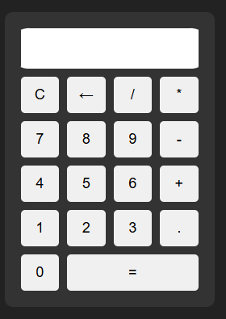

<h1>🧮 Calculadora Online</h1>

Uma calculadora simples, moderna e responsiva desenvolvida com HTML5, CSS3 e JavaScript.
Projeto criado para estudo e prática de desenvolvimento web, com foco em lógica, interface e boas práticas de código.

<h1>🚀 Demonstração </h1>

👉 https://martoxm.github.io/calculadora-online/

<h1>📌 Funcionalidades</h1>

- Operações básicas: adição, subtração, multiplicação e divisão
- Botão de limpar tudo (C)
- Botão de apagar último caractere (←)
- Suporte a números decimais
- Interface simples e intuitiva
- Totalmente responsiva

<h1>🛠️ Tecnologias Utilizadas</h1>

- HTML5 - Estrutura da aplicação
- CSS3 - Estilização e layout responsivo
- JavaScript - Lógica da calculadora

<h1>📖 Como usar</h1>

- Clone o repositório:
  git clone https://github.com/martoxm/calculadora-online.git
- Abra o arquivo index.html no navegador
- Use a calculadora normalmente

<h1>📚 Documentação técnica</h1>

Se quiser revisar com calma o que foi feito no layout, no header e na interatividade, leia o arquivo [DOCUMENTACAO_HEADER_INTERATIVO.md](./DOCUMENTACAO_HEADER_INTERATIVO.md). Ele foi escrito para servir como material de estudo e para reaplicar a mesma ideia em outros projetos.

<h1>🎯 Objetivo do Projeto</h1>

Este projeto foi desenvolvido como parte do meu aprendizado em desenvolvimento web, com foco em:

- Praticar HTML, CSS e JavaScript do zero
- Criar interfaces funcionais e responsivas
- Construir um portfólio sólido para conquistar meu primeiro estágio na área

<h1>📸 Preview</h1>

<h1>📬 Contato</h1>

Se quiser trocar uma ideia sobre tecnologia, projetos ou oportunidades:

Gabriel — Desenvolvedor Web em formação

📧 gabriel.martorelli@hotmail.com

💼 https://www.linkedin.com/in/gabrielmartorelli

